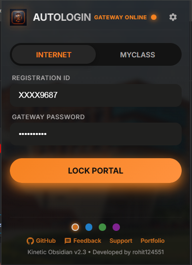
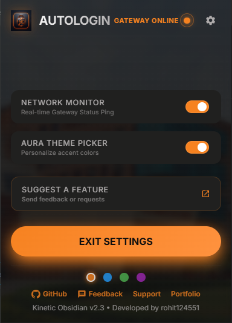

# 🚀 LPU Auto Login | Kinetic Obsidian V2.5

[](https://opensource.org/licenses/MIT)
[](https://www.lpu.in)

**LPU Auto Login** is a lightweight, high-performance Chrome Extension designed to automate logins for LPU students. It focuses on the Internet Portal and MyClass for a seamless browsing experience.

---

## ✨ Features

- **🎓 Comprehensive LPU Support**: Automates logins for `myclass.lpu.in` (UMS), `oas.lpu.in`, and Codetantra-powered portals.
- **🛡️ Kinetic Obsidian UI**: A modern, glassmorphic dark theme with custom backgrounds and smooth transitions.
- **🎨 Custom Aura Themes**: Personalize your interface with **Electric Blue**, **Neon Green**, **Cyber Purple**, or **Kinetic Orange**.
- **📡 Network Monitor**: Real-time Gateway status indicator for `internet.lpu.in` and `10.10.0.1`.
- **⚙️ Modular Settings**: Toggle extra features on or off via the new Settings panel.
- **🚀 Onboarding Experience**: Automatic redirect to a custom "Thank You" page upon installation for a professional setup.
- **🔒 AES-GCM Vault Encryption**: Passwords are encrypted with 256-bit AES-GCM and bound to your User ID. Stored locally only — zero external tracking.
- **⚡ Master Auto-Login Toggle**: Instantly enable or disable auto-login from the popup. When OFF, nothing fires — no form fill, no login attempt, strictly enforced.

---

## 🛠️ Installation

1.  **Download this repository** as a ZIP or clone it:
    ```bash
    git clone https://github.com/rohit124551/LPU-Auto-Login.git
    ```
2.  Open **Google Chrome** and go to `chrome://extensions/`.
3.  Enable **"Developer mode"**.
4.  Click **"Load unpacked"** and select the extension folder.
5.  Enter your credentials in the popup and hit **LOCK PORTAL**.

---

## 📸 UI Preview (Kinetic Obsidian)

The UI uses a **Soft 3D Neumorphic** design, providing a premium interactive experience.

| Main Interface | Settings Panel |
| :---: | :---: |
|  |  |

---

## 🔍 Feature Breakdown

### 1. Main Interface (`interface.png`)
- **Dual Flow**: Switch between **INTERNET** (Gateway Login) and **MYCLASS** (UMS/Classes) using the editorial tabs.
- **Registration ID & Password**: Enter your LPU credentials once. They are encrypted using **AES-GCM** and stored locally in your browser's "Vault" (`chrome.storage.local`).
- **LOCK PORTAL**: Securely encrypts and saves your credentials to auto-fill and submit login forms whenever you visit the portal.
- **Network Status Orb**: A dynamic indicator (top right) that shows real-time connectivity to LPU servers.

### 2. Settings Panel (`Setting.png`)
- **Network Monitor Toggle**: Enable or disable the real-time background pinging of LPU Gateway servers.
- **Aura Theme Picker Toggle**: Toggle the visibility of the color customization dots in the footer.
- **Support Links**: Quick access to suggests features via Google Forms, GitHub repository, and Developer Portfolio.
- **Exit Settings**: One-tap navigation back to the main login controls.

---

## 🛡️ Security & Encryption

LPU Auto Login prioritizes student data safety by implementing a multi-layered security architecture:

### 1. 📂 Local-Only Storage
Your credentials **never** leave your computer. We do not use any external servers or databases. All data is saved exclusively in your browser's private `chrome.storage.local`.

### 2. 🔑 Unique Dynamic Key (Per User)
Every single student who installs this extension gets their own **unique, random 256-bit AES key** generated locally in their browser. 
- **No Two Keys are Alike**: Your encryption key is different from every other student's key.
- **Privacy**: The developer of this extension cannot see or access your key.

### 3. 🔒 AES-GCM (Identity Bound)
We use **AES-GCM (Advanced Encryption Standard)** with **Identity Binding (AAD)**:
- **How it works**: The User ID is mathematically included in the encryption process.
- **Result**: Even if someone managed to steal your encrypted data and your private key, they **cannot** decrypt your password without also providing your exact Registration ID.

> [!IMPORTANT]
> **Zero Exposure Architecture**
> Even if a malicious actor manually exports your browser's local storage data, it remains **unreadable and useless**. The data is "double-locked" by your unique local key and your Registration ID.

---

## 🎨 Aura Theme Engine
The extension features 4 pre-configured **Aura Themes** accessible via the footer dots:
- **Kinetic Orange** (Default)
- **Electric Blue**
- **Neon Green**
- **Cyber Purple**

Clicking a dot applies a unique hue-rotation and accent color across the entire interface, saved instantly to your profile.

---

## 🖥️ Developers & Contact

Developed by **rohit124551**, an LPU CSE Student passionate about automation and clean UI.

- 🐙 **GitHub**: [rohit124551](https://github.com/rohit124551)
- 💼 **Portfolio**: [rohitkumarranjan.in](https://rohitkumarranjan.in)
- 📧 **Support**: [hello@rohitkumarranjan.in](mailto:hello@rohitkumarranjan.in)

[](https://star-history.com/#rohit124551/LPU-Auto-Login&Date)


---

## ⚖️ Disclaimer

This extension is an independent student project and is NOT affiliated with Lovely Professional University. Use responsibly.

---

*Star this repo if it saved you time! ⭐*

---

## 📋 Changelog

### v2.5 — Security & Control Update
> Released: April 2026

- 🔒 **AES-GCM (256-bit) Encryption** — Passwords are now encrypted before storage. Plain-text passwords no longer exist in local storage.
- 🔑 **Unique Dynamic Key per Installation** — Every student gets their own randomly generated AES key. No two extensions share the same key.
- 🪪 **Identity Binding (AAD)** — Each password is mathematically locked to the specific Registration ID it belongs to. Without the matching ID, decryption is cryptographically impossible.
- 🧠 **Background-Side Decryption** — Decryption happens exclusively in the extension background process. LPU portals never see the encryption keys or decryption logic.
- ⚡ **Master Auto-Login ON/OFF Toggle** — A prominent power chip in the popup lets users instantly enable/disable automatic login.
- 🚀 **Smooth Migration Engine** — Intelligent legacy detection allows seamless upgrades from older versions without user re-authentication.
- 🧵 **Atomic Key Initialization** — Advanced synchronization ensures secure, race-condition-free initialization across multiple browser contexts (Popup & Service Worker).

### v2.3 — Kinetic Obsidian UI
> Released: April 2026

- ✨ Full Kinetic Obsidian glassmorphic UI redesign
- 🎨 Aura Theme Engine (4 color themes)
- 📡 Real-time Network Monitor with Gateway status
- ⚙️ Modular Settings Panel
- 🚀 Custom onboarding redirect on install
